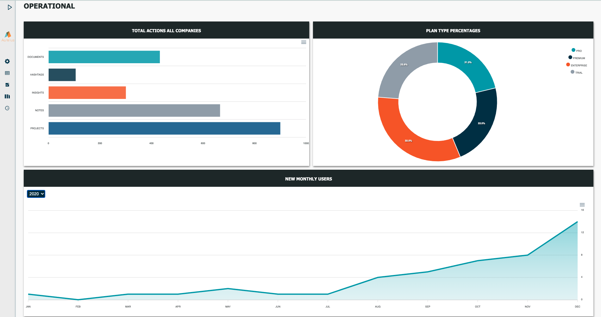
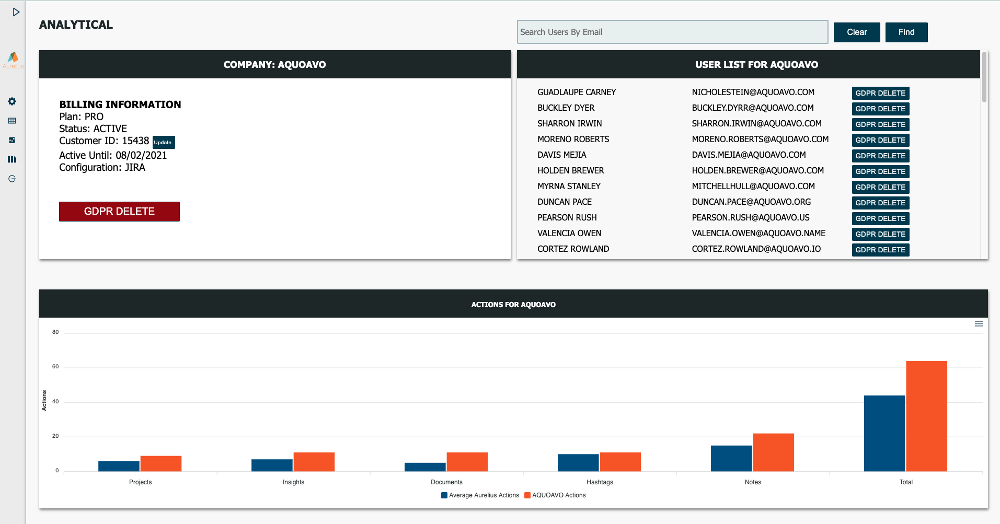
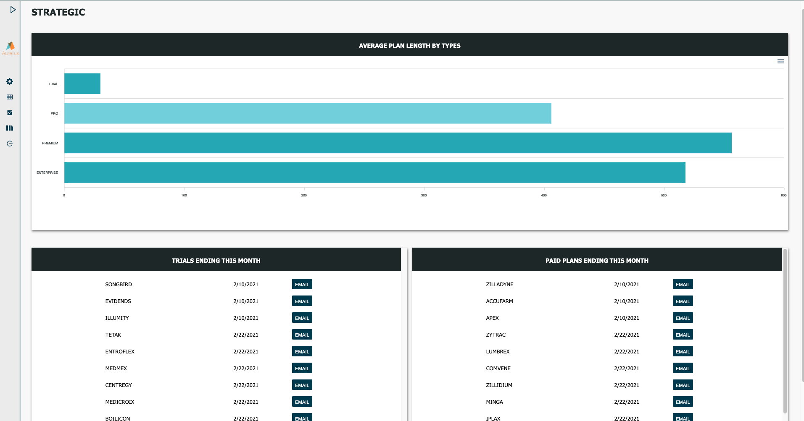

# Imperator

Imperator is an internal tool to easily see client information in one place. With this dashboard you can automate internal processes such as extending trails, following up emails to canceled clients, discount offers, resetting passwords, updating client info, GDPR for company’s data, and display information from various APIs. Solving the issue of manually going through multiple processes and systems to update this information. Imperator was a group project completed fully remotely in a two-week sprint.

## Group members

[@Brady](https://github.com/bradybaker)
[@Malik](https://github.com/MalikElate)
[@Josie](https://github.com/freder48)
[@James](https://github.com/jposeyjr)

## Built With

Typescript, Javascript, React, Redux, Node, Express, MongoDB, and Passport, ApexCharts

## Prerequisites

Before you get started, make sure you have the following software installed on your computer:

- [Node.js](https://nodejs.org/en/)
- [MongoDB Atlas](https://www.mongodb.com/)
- [Nodemon](https://nodemon.io/)
- [Typescript](https://www.typescriptlang.org/)

## Create an atlas account and cluster

Go to mongodb and sign up for a free tier cluster. Add a MONGO_URI to a .env file

## Local Setup Instructions

- Run `npm install`
- Create a `.env` file at the root of the project and paste this line into the file:
  ```
  SERVER_SESSION_SECRET=superDuperSecret
  NODE_ENV = development
  MONGO_URI=mongo uri
  **FOR TESTING PURPOSE ONLY**
  TEST_USER=username for website
  TEST_PASSWORD=password for website
  TEST_EMAIL=email for sending emails
  ```
  While you're in your new `.env` file, take the time to replace `superDuperSecret` with some long random string like `25POUbVtx6RKVNWszd9ERB9Bb6` to keep your application secure. Here's a site that can help you: [https://passwordsgenerator.net/](https://passwordsgenerator.net/). If you don't do this step, create a secret with less than eight characters, or leave it as `superDuperSecret`, you will get a warning.
- Run `npm run server`
- Run `npm run client`
- Navigate to `localhost:3000`

## How To Deploy To Heroku

### Heroku Prerequisite

1. Sign up for an account on [Heroku.com](https://www.heroku.com/)
2. Install Heroku CLI by typing `brew tap heroku/brew && brew install heroku` in Terminal

- [Additional installation notes and troubleshooting](https://devcenter.heroku.com/articles/heroku-cli#download-and-install)

> Note: Your project also needs to have a git repository.

Run the following commands from within your project folder.

1. Authenticate by typing `heroku login` in Terminal
2. In terminal, navigate to your project folder and type `heroku create`
3. Type `git remote -v` to ensure it added successfully
4. In terminal, type `git push heroku main`

## Screenshots





